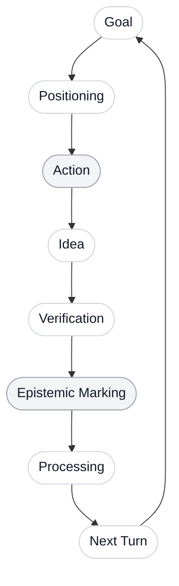

# AI Learn OS

> **An AI-native learning state management system.**
>
> Not a knowledge base. Not a note-taking app. Not an AI summarizer.
> AI Learn OS manages the learner's relationship with knowledge: goals, claims,
> distinctions, epistemic status, derivation trust, review triggers, and the next
> best learning action.

AI Learn OS looks like a minimal chat interface. Internally, it behaves like a
learning operating system. The learner asks questions or clicks `Run Next`; the
system handles intent parsing, project resolution, context packaging, learning
state judgment, teaching-method routing, answer generation, assessment, and
durable state writeback.

The core thesis is simple:

**AI can generate knowledge on demand, but it cannot understand on your behalf.**

---

## Why AI Learn OS?

### 1. Quiet Surface, Deep System

The learner sees a clean conversation stream, a project path, a compact learning
state indicator, a morphing `Run Next` button, and a hidden Inspector.

The system complexity stays below the surface. Every `/api/chat` request enters
an orchestrated pipeline:

- parse the user's intent;
- resolve the current project;
- select relevant goals, references, and learner-state records;
- build a runtime Context Pack;
- judge the current learning state;
- route to the appropriate learning module;
- compose the answer;
- distill durable learner-side state.

The product principle is deliberate:

**The interface should stay quiet. The system should be deep.**

### 2. From Knowledge Management to Learning State Management

Traditional knowledge tools try to store world knowledge. AI Learn OS does not.

AI can explain concepts, generate examples, compare theories, and reconstruct
derivations dynamically. The scarce state worth preserving is learner-side
evidence:

- What is the learner trying to achieve?
- Which claims did the learner make?
- Which concepts are being confused?
- Which derivation steps were personally reconstructed?
- Which steps were only AI-hinted?
- Which concepts must enter no-AI internalization?
- What should happen next?

AI Learn OS stores learning relationships rather than encyclopedia entries:

`Goals`, `Claims`, `Distinctions`, `Temporal Traces`, `Knowledge Positions`,
`Epistemic Marks`, `Derivation Trust`, `Review Triggers`, and
`Misconception Records`.

### 3. Institutionalized Human Agency

AI may suggest, explain, question, critique, and schedule review.

AI must not replace:

- the learner's final judgment;
- the learner's personal derivation work;
- the learner's no-prompt reconstruction ability;
- the learner's commitment to whether something is truly understood.

That is why the state writer is conservative. AI judgments are computation, not
memory. Durable memory stores learner-side evidence.

---

## Core Learning Loop

AI Learn OS does not treat a chat turn as an isolated Q&A event. Each turn is
placed inside a continuous learning loop.



The loop can be triggered by a user message or by the empty-input `Run Next`
action.

`Run Next` is not random continuation. It reads the current learning state and
chooses the next action by priority:

1. due or failed review triggers;
2. recurring misconceptions;
3. no-AI internalization below the target level;
4. derivation trust gaps;
5. distinction tests or retests;
6. current goal next action;
7. recent unresolved questions;
8. new knowledge progression.

---

## Multi-Agent Backend Pipeline

Every `/api/chat` request passes through a fixed 8-agent pipeline. Agent outputs
are structured JSON and validated with Pydantic contracts.


The important architectural rule:

**Context extraction, state judgment, and module routing are ephemeral by
default.**

They may appear in `pipeline_trace`, but they are not automatically promoted to
learning memory. Durable records are created by the post-turn State Writer and
assessment services only when grounded in learner-side evidence: a user question,
answer attempt, confusion, correction, derivation attempt, no-AI response, or
review outcome.

---

## Product Experience

### Top HUD

The top HUD keeps the current project and learning state visible without turning
the app into a dashboard. It shows:

- project path;
- current internalization indicator, such as `A1: Internalizing`;
- a hidden-hover preview of the current goal and recent claim;
- the Inspector entry point.

### Smart Input

The bottom composer is the main control surface.

- When the input is empty, the action button shows `Run Next`.
- When the learner starts typing, it becomes `Send`.
- The `+` button opens a compact teaching-method menu.
- Manual methods are temporary overrides, not the default workflow.

Supported teaching methods include:

- Explain;
- Compare;
- Socratic;
- Derive;
- Exercise;
- Critic;
- Review;
- No-AI Test.

### Right Inspector

The Inspector is hidden by default. It contains the complexity that should not
clutter the main chat:

- Projects;
- Project Settings;
- System Settings;
- Learning State;
- References;
- Claims;
- Distinctions;
- Review Triggers;
- Knowledge Positions;
- Derivation Trust;
- Learning Units;
- Learning Summary.

The Learning State tab starts with a compact summary:

- current blocker;
- primary next action;
- evidence;
- key counts.

---

## Learning Units

Context preprocessing is unit-scoped, not turn-scoped.

A **Learning Unit** is a short-lived micro-session, such as:

- a Socratic questioning sequence;
- a derivation coaching sequence;
- an exercise correction loop;
- a flawed interpretation critique;
- a no-AI reconstruction test;
- a review point run;
- a comparison or concept explanation follow-up.

At unit start, the system performs full context extraction and stores a short-term
`context_snapshot_json`. Later turns in the same unit reuse the snapshot plus
recent `learning_unit_turns` until the unit is closed, refreshed, abandoned, or
superseded by a higher-priority global task.

Learning Unit context is working memory. It is not final learner memory.
Durable learner state is written by post-turn or unit-close distillation.

---

## Learning Assessment Loop

The alpha system evaluates learning evidence instead of merely logging events.

### No-AI Reconstruction

No-AI tests score internalization from A0 to A4:

| Level | Meaning |
|---|---|
| A0 | Important, but not yet demonstrated. |
| A1 | The learner can give a basic definition or rough explanation. |
| A2 | The learner can distinguish the concept from nearby concepts. |
| A3 | The learner can reconstruct, apply, or derive it in a useful setting. |
| A4 | The learner can retrieve and apply it after delay without AI prompting. |

A4 is intentionally strict. It should not be granted from a single fresh answer.

### Derivation Trust

Derivation records distinguish:

- steps done by the learner;
- steps hinted by AI;
- untrusted or missing steps;
- next re-derivation time;
- reconstruction status.

### Distinction Tests

Distinctions support test and retest states:

- `needs_test`;
- `partially_clear`;
- `clear`;
- `failed`;
- `needs_retest`.

### Claim Epistemic Status

Claims are classified with epistemic discipline:

- `strict_fact`;
- `derived_result`;
- `standard_interpretation`;
- `heuristic`;
- `analogy`;
- `inference`;
- `speculation`;
- `learning_strategy`;
- `wrong`;
- `open_question`.

### Misconception Recurrence

Repeated boundary errors become durable blockers. They can influence the Learning
Summary and `Run Next` priority.

### Review Trigger Loop

Review triggers can be:

- `pending`;
- `completed`;
- `failed`;
- `skipped`.

Completed and skipped triggers are ignored by `Run Next`; due pending and failed
triggers are prioritized.

---

## Model Gateway

AI Learn OS supports OpenAI-compatible providers with three model tiers:

| Tier | Intended Use |
|---|---|
| Fast | Lightweight future judgments and cheap checks. |
| Medium | Structured state writing and unit-close distillation. |
| Strong | Final teaching answer generation. |

If no provider is configured, the system uses `FakeModelGateway` and deterministic
fallbacks. Tests never require real API keys.

Environment variables:

```bash
OPENAI_API_KEY=sk-...
OPENAI_BASE_URL=https://api.openai.com/v1
AI_LEARN_FAST_MODEL=gpt-4o-mini
AI_LEARN_MEDIUM_MODEL=gpt-4.1-mini
AI_LEARN_STRONG_MODEL=gpt-4.1
```

Use the diagnostic script:

```bash
.venv/bin/python scripts/check_ai_path.py
```

It prints the selected gateway and model names without printing the API key.

---

## Reference Context

References can be added by paste or upload. Text, Markdown, and PDF inputs are
chunked and stored as reference chunks.

Current alpha behavior:

- deterministic keyword ranking;
- no embeddings required;
- relevant chunks enter ContextPack;
- unit context reuses selected chunks;
- context packs are not persisted by default unless debug persistence is enabled.

The production data path is designed for PostgreSQL + pgvector, but the local
runtime works with SQLite.

---

## Tech Stack

| Layer | Stack |
|---|---|
| Current Frontend | React + Vite + TypeScript |
| Product Frontend Target | Next.js App Router, Tailwind CSS, shadcn/ui, Radix UI |
| Icons | Lucide Icons |
| Motion Target | Framer Motion |
| API | FastAPI-compatible JSON API |
| Orchestration | Python, Pydantic, deterministic agent contracts |
| Local Runtime | SQLite |
| Production Data Path | PostgreSQL + pgvector |
| Background Jobs | Redis-ready |
| Model Gateway | OpenAI-compatible providers, fast / medium / strong tiers |
| Tests | pytest, FakeModelGateway, frontend typecheck/build |

---

## Current Capabilities

- ChatGPT-style main conversation UI;
- compact Top HUD;
- floating Smart Input;
- empty-input `Run Next`;
- input-state `Send`;
- hidden `+` teaching-method menu;
- right-side Inspector;
- multi-project support;
- project settings and system settings;
- CFT demo seed project;
- reference paste, upload, and chunking;
- `/api/chat` 8-agent pipeline;
- `/api/run-next` priority routing;
- Learning Unit creation, reuse, refresh, close, and close-time distillation;
- Context Pack runtime usage with optional debug persistence;
- selective State Writer writeback;
- Claim, Distinction, Temporal Trace, Review Trigger records;
- Knowledge Position and Derivation Trust records;
- No-AI, derivation, distinction, claim, misconception, and review assessment;
- State update revert;
- SQLite local runtime;
- PostgreSQL + pgvector schema documentation;
- FakeModelGateway test path;
- OpenAI-compatible provider path.

---

## Quickstart

### 1. Install Python Dependencies

```bash
python3 -m venv .venv
.venv/bin/python -m pip install ".[dev]"
```

Confirm that the CLI works:

```bash
.venv/bin/learn --help
```

For source development, editable install is also available:

```bash
.venv/bin/python -m pip install -e ".[dev]"
```

If your local Python or venv does not process editable `.pth` files correctly,
use the source-path fallback:

```bash
PYTHONPATH=src .venv/bin/python -m ailearn.cli ui --dev
```

### 2. Configure an AI Provider

Without an API key, the system runs with `FakeModelGateway` and deterministic
fallbacks. This is enough for local smoke tests and CI.

To enable a real OpenAI-compatible provider:

```bash
export OPENAI_API_KEY="sk-..."
export OPENAI_BASE_URL="https://api.openai.com/v1"
export AI_LEARN_FAST_MODEL="gpt-4o-mini"
export AI_LEARN_MEDIUM_MODEL="gpt-4.1-mini"
export AI_LEARN_STRONG_MODEL="gpt-4.1"
```

Do not commit `.env` or real API keys.

Check the selected gateway:

```bash
.venv/bin/python scripts/check_ai_path.py
```

### 3. Optional: Start PostgreSQL and Redis

```bash
docker compose up -d postgres redis
```

Local development can also use the SQLite fallback:

```text
data/ai_learn_os.sqlite3
```

### 4. Build and Run the App

Build the frontend once:

```bash
cd web
npm install
npm run build
cd ..
```

Start the combined API + Web server:

```bash
.venv/bin/learn ui --dev
```

Open:

```text
http://127.0.0.1:8765
```

### 5. Frontend Development Mode

In one terminal, run the backend:

```bash
.venv/bin/learn ui --dev
```

In another terminal, run Vite:

```bash
cd web
npm install
npm run dev
```

Open:

```text
http://127.0.0.1:5173
```

Vite proxies `/api` to `127.0.0.1:8765`.

### 6. Troubleshooting

If the browser reports `Unknown endpoint` or `API returned an empty response`,
you may still have an old server process running on port `8765`. Stop it and
restart:

```bash
.venv/bin/learn ui --dev
```

You can also launch directly from the current source tree on another port:

```bash
PYTHONPATH=src .venv/bin/python -m ailearn.cli ui --dev --port 8766
```

---

## CFT Demo Project

The Projects tab contains a real `Create Demo: CFT` action. It calls:

```text
POST /api/projects/seed/cft
```

You can also run the seed script:

```bash
.venv/bin/python scripts/seed_cft_learning.py
```

The demo creates a focused project:

```text
I want to learn CFT
```

It includes:

- Goal Stack;
- reference chunks;
- claims;
- distinctions;
- knowledge positions;
- review triggers;
- derivation trust records.

Recommended first question:

```text
Why can 2D CFT describe a second-order critical point?
```

Then click `Run Next` and open the Inspector to inspect:

- Current Blocker;
- Next Action;
- Evidence.

---

## Alpha Pack Smoke Test

No real API key is required:

```bash
.venv/bin/python scripts/smoke_alpha_pack.py
```

The smoke script uses a temporary SQLite database and verifies:

- database initialization;
- CFT seed project;
- `/api/chat`;
- `/api/run-next`;
- `/api/projects/:id/learning-summary`;
- reference chunks entering ContextPack.

---

## API Overview

Core endpoints:

```text
POST /api/chat
POST /api/run-next

GET  /api/projects
POST /api/projects
POST /api/projects/seed/cft
GET  /api/projects/:id
PATCH /api/projects/:id

GET  /api/projects/:id/settings
PATCH /api/projects/:id/settings
GET  /api/system-settings
PATCH /api/system-settings

GET  /api/projects/:id/state
GET  /api/projects/:id/learning-summary

POST /api/projects/:id/references
POST /api/projects/:id/references/upload
GET  /api/projects/:id/references
GET  /api/references/:id/chunks

GET  /api/projects/:id/learning-units/active
GET  /api/projects/:id/learning-units
POST /api/projects/:id/learning-units/:unit_id/close
POST /api/projects/:id/learning-units/:unit_id/refresh-context

POST /api/review-triggers/:id/complete
POST /api/review-triggers/:id/fail
POST /api/review-triggers/:id/skip

POST /api/state-updates/:id/revert
```

See [docs/api.md](docs/api.md) for details.

---

## Development Checks

```bash
.venv/bin/python -m compileall src
.venv/bin/python -m pytest -q
cd web && npm run typecheck
cd web && npm run build
```

Tests use `FakeModelGateway` and do not require real model credentials.

---

## Documentation

- [Architecture](docs/architecture.md)
- [Agent Contracts](docs/agent_contracts.md)
- [API](docs/api.md)
- [Database](docs/database.md)
- [Alpha Feature Audit](docs/alpha_feature_audit.md)
- [Reference RAG Alpha](docs/reference_rag_alpha.md)
- [UI Action Audit](docs/ui_action_audit.md)
- [Frontend Structure Gap Report](docs/frontend_structure_gap_report.md)
- [Pack Readiness](docs/pack_readiness.md)

---

## Roadmap

### v0.1 - MVP Prototype

- Web/API-first ChatGPT-style learning interface;
- `/api/chat` 8-agent pipeline;
- `/api/run-next` automatic next-action routing;
- State Writer for Claim, Distinction, Temporal Trace, and Review Trigger;
- optional debug Context Pack persistence;
- FakeModelGateway test loop.

### v0.2 - Multi-Project Learning OS

- multi-project management;
- project switching;
- project settings and system settings;
- reference management;
- review triggers;
- knowledge positions;
- Learning Unit context reuse.

### v0.3 - Trust and Internalization

- Derivation Trust;
- No-AI Reconstruction Test;
- A0-A4 internalization levels;
- Flawed Interpretation Critic;
- recurring misconception tracking;
- stronger unit-close distillation.

### v0.4 - Research Extension

- Research Question;
- Hypothesis;
- Evidence;
- Competing Explanation;
- Advisor Feedback;
- Next Experiment;
- Project Report Generator.

---

## Project Principles

AI Learn OS is not trying to replace the learner.

It is trying to enforce a stricter learning discipline:

```text
AI handles complexity.
The learner keeps agency.
Durable memory stores evidence.
Understanding must be reconstructed.
```

If a conclusion was merely stated by AI, it is not learning state.

If a derivation was merely shown by AI, it is not derivation trust.

If a concept was merely summarized, it has not yet entered the learner's head.

AI Learn OS exists to make AI serve human judgment, not erase it.
