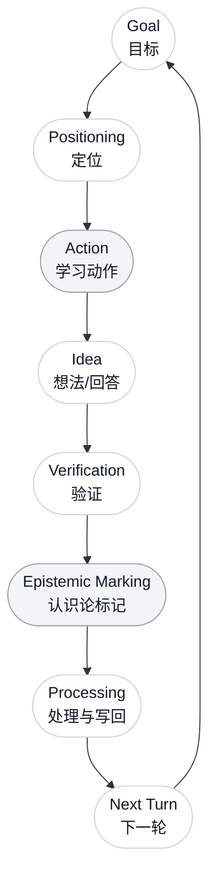

# AI Learn OS

> **AI-native Learning State Management System**  
> 不是知识库，不是笔记软件，也不是 AI 摘要器。AI Learn OS 管理的是学习者与知识之间的关系：目标、位置、判断、误区、推导信任与下一步行动。

AI Learn OS 的界面像一个极简聊天窗口；它的内部像一个学习操作系统。用户只需要提出问题，系统在后台完成意图识别、项目定位、上下文打包、学习状态判断、教学方法路由、回答生成与状态写回。

它的核心命题很简单：

**AI 可以动态生成知识，但不能替你完成理解。**

---

## 为什么是 AI Learn OS？

### 1. 前台极简，后台复杂

用户看到的只是一个干净的对话界面、一个项目路径、一枚学习状态指示器、一个会变形的 `Run Next` 按钮，以及一个隐藏的 Inspector。

真正复杂的工作不暴露在屏幕上。每次 `/api/chat` 都会进入 Orchestrator，由多 Agent 管线处理：

- 解析用户意图；
- 解析当前学习项目；
- 选择相关目标、参考资料和历史学习状态；
- 构造 Context Pack；
- 判断当前学习状态；
- 选择教学模块；
- 生成回答；
- 写回学习者侧状态。

这是一种 Steve Jobs 式的产品原则：**表面必须安静，系统必须深。**

### 2. 从知识管理转向学习状态管理

传统知识管理试图保存“世界知识”。AI Learn OS 不这么做。

AI 可以在运行时解释概念、生成例子、比较理论、展开推导。真正稀缺、真正需要保存的是学习者自己的状态：

- 我当前的目标是什么？
- 我把什么当成了事实、类比、猜想或误区？
- 我在哪两个概念之间混淆？
- 哪个推导我只是看懂了，哪个推导我真的能重构？
- 哪些东西必须进入无 AI 内化区？
- 下一轮最值得做什么？

因此，AI Learn OS 存储的不是百科知识，而是学习关系：

`Goals`、`Claims`、`Distinctions`、`Temporal Traces`、`Knowledge Positions`、`Epistemic Marks`、`Derivation Trust`、`Review Triggers`。

### 3. 制度化人的主体性

AI 可以建议、解释、追问、出题、批判和提醒。

但 AI 不能替代：

- 学习者的最终判断；
- 学习者亲自完成的推导；
- 学习者在无提示状态下的重构能力；
- 学习者对“我是否真的理解了”的承诺。

AI Learn OS 的状态写回策略正是为此设计的：AI 中间判断是计算，不是记忆。只有有学习者侧证据的状态，才会进入 durable memory。

---

## 核心学习闭环

AI Learn OS 不把一次对话视作孤立问答，而是把它放入一个连续的学习循环。



这个闭环可以由用户输入触发，也可以由空输入状态下的 `Run Next` 触发。

`Run Next` 不随机生成内容。它读取当前学习状态，并按优先级选择下一步：

1. 到期的 Review Trigger；
2. 反复出现的误区；
3. 无 AI 内化区但未验证的内容；
4. 当前 Goal 的下一步；
5. 最近未解决的问题；
6. 新知识推进。

---

## 后端多 Agent 管线

每次 `/api/chat` 都会经过固定的 8 步 Agent Pipeline。每个 Agent 输出结构化 JSON，并通过 Pydantic 合约校验。

```mermaid
graph LR
  A([Request Intake<br/>意图识别])
  B([Project Resolver<br/>项目定位])
  C([Context Extractor<br/>上下文选择])
  D([Context Pack Builder<br/>上下文打包])
  E([State Judge<br/>学习状态判断])
  F([Module Router<br/>教学模块路由])
  G([Answer Composer<br/>回答生成])
  H([State Writer<br/>状态写回])

  A --> B --> C --> D --> E --> F --> G --> H

  classDef agent fill:#ffffff,stroke:#d1d5db,color:#111827,stroke-width:1px;
  classDef memory fill:#f9fafb,stroke:#9ca3af,color:#111827,stroke-width:1px;

  class A,B,C,D,E,F,G,H agent;
  style D fill:#f9fafb,stroke:#9ca3af
  style H fill:#f3f4f6,stroke:#6b7280
```



重要的是：`Context Extractor`、`State Judge`、`Module Router` 的判断默认是 ephemeral computation。它们可以进入 `pipeline_trace`，但不会自动变成学习记忆。

真正进入 durable memory 的，是 State Writer 从用户问题、用户回答、用户错误、自我修正、推导尝试和无 AI 测试中提炼出的学习者状态。

---

## 关键交互与 UI 架构

### Top HUD：Learning Island

顶部 HUD 使用轻量 frosted-glass 视觉：左侧是项目路径，中间是学习状态胶囊，右侧是 Inspector 入口。

状态胶囊显示当前内化等级，例如：

```text
A1: Internalizing
```

悬停时，它会展开显示当前 Goal 与最近 Claim。用户不需要进入复杂后台，也能知道系统正在怎样理解当前学习位置。

### Smart Input：会变形的学习输入区

底部输入区是主交互中心。

- 输入为空时，右侧按钮显示 `Run Next`，并有微弱呼吸感，提示系统可以自动推进下一步；
- 用户开始输入时，按钮变成发送动作；
- 左侧 `+` 打开教学方法菜单；
- 教学方法不会常驻屏幕，避免把学习界面变成控制台。

这使 AI Learn OS 的默认体验保持简单：

```text
直接提问 -> 系统自动选择教学方法 -> 回答 -> 写回学习状态
```

手动教学方法只是 override：

- Explain；
- Compare；
- Socratic；
- Derive；
- Exercise；
- Critic；
- Review；
- No-AI Test。

### Progressive Disclosure Command Menu

复杂能力被隐藏在 `+` 菜单与未来的 `/` slash command 中。

用户不需要每轮都选择“解释 / 比较 / 推导 / 出题”。系统默认自动选择。只有当用户明确想接管教学方式时，才展开命令菜单。

### Right Inspector

右侧 Inspector 默认隐藏，只在需要时打开。它承载所有复杂状态：

- Projects；
- Project Settings；
- System Settings；
- Learning State；
- References；
- Claims；
- Distinctions；
- Review Triggers；
- Knowledge Positions；
- Derivation Trust。

主界面始终保持纯净，复杂性被放到正确的位置。

---

## 学习单元：Unit-scoped Context

AI Learn OS 不再把每一轮对话都当作全局上下文抽取任务。

系统引入 **Learning Unit**：一个短生命周期的学习微会话，例如：

- 一组 Socratic 追问；
- 一次推导教练过程；
- 一轮错题修正；
- 一次概念边界比较；
- 一次无 AI 重构测试；
- 一次 Review Trigger 回看。

在学习单元开始时，系统执行完整 Context Extraction，并保存一份短期 `context_snapshot_json`。同一单元内的后续轮次复用这份快照与最近 `learning_unit_turns`，直到：

- 用户手动切换教学方法；
- 话题明显漂移；
- 单元达到轮次上限；
- 用户要求结束；
- Run Next 判定需要刷新或关闭。

Learning Unit 是工作记忆，不是最终学习记忆。最终学习状态仍由 State Writer 写入 durable memory。

---

## 学习评估闭环

Alpha 版本开始评估学习证据，而不只是记录学习事件。

- **No-AI Test**：根据用户无提示回答更新 A0-A4；A4 必须来自延迟回看成功，不能由一次新鲜回答直接获得。
- **Derivation Trust**：逐步区分 `done_by_user`、`hinted_by_ai` 与 `untrusted_steps`。
- **Distinction Test**：区分记录支持 `needs_test`、`partially_clear`、`clear`、`failed`、`needs_retest`。
- **Claim Epistemic Status**：把用户 Claim 校准为 fact、inference、analogy、learning strategy、wrong 或 open question。
- **Misconception Recurrence**：反复误区会形成 durable blocker，并进入 Inspector 与 Run Next 优先级。
- **Review Trigger Loop**：回看点可以 completed / failed / skipped；失败或到期项会优先驱动下一轮。

这些评估只在有用户回答、无 AI 尝试、推导尝试、概念边界测试或明确修正时写入 durable memory。AI 的中间判断仍然只是计算。

---

## 技术栈

AI Learn OS 的目标产品栈：

| Layer | Stack |
|---|---|
| Frontend Target | Next.js App Router, Tailwind CSS, shadcn/ui, Radix UI |
| Motion | Framer Motion |
| Icons | Lucide Icons |
| API | FastAPI-compatible JSON API |
| Orchestration | Python, Pydantic, deterministic Agent contracts |
| Local Runtime | SQLite |
| Production Data Path | PostgreSQL + pgvector |
| Background Jobs | Redis |
| Model Gateway | OpenAI-compatible providers, fast / medium / strong tiers |
| Tests | FakeModelGateway, pytest, frontend typecheck/build |

当前仓库的前端原型仍位于 `web/`，以 React + Vite 运行。UI 和 API 契约已经按 Web-first 产品方向实现；Next.js / shadcn / Framer Motion 是正式产品化前端目标栈。

---

## 当前能力

- ChatGPT 式主对话界面；
- 极简 Top HUD；
- 浮动 Smart Input；
- 空输入 `Run Next`；
- 输入态自动变为 Send；
- `+` 教学方法菜单；
- 右侧隐藏 Inspector；
- 多项目；
- 项目设置与系统设置；
- Reference 添加、上传与 chunk；
- `/api/chat` 八 Agent 管线；
- `/api/run-next` 优先级决策；
- Learning Unit 创建、复用、刷新与关闭；
- Context Pack 默认不持久化；
- State Writer 选择性写回；
- Claim / Distinction / Temporal Trace / Review Trigger；
- Knowledge Position 与 Derivation Trust；
- State update revert；
- SQLite 本地运行；
- Postgres + pgvector schema；
- FakeModelGateway 测试路径。

---

## 快速开始

### 1. 安装后端

```bash
python3 -m venv .venv
.venv/bin/python -m pip install -e ".[dev]"
```

### 2. 启动数据库服务

```bash
docker compose up -d postgres redis
```

本地开发也可以直接使用 SQLite fallback：

```text
data/ai_learn_os.sqlite3
```

### 3. 启动 API

```bash
.venv/bin/learn ui --dev
```

API 默认运行在：

```text
http://127.0.0.1:8765
```

### 4. 启动前端

```bash
cd web
npm install
npm run dev
```

打开：

```text
http://127.0.0.1:5173
```

Vite 会将 `/api` 代理到 `127.0.0.1:8765`。

---

## API 一览

核心端点：

```text
POST /api/chat
POST /api/run-next
GET  /api/projects
POST /api/projects
GET  /api/projects/:id
PATCH /api/projects/:id
GET  /api/projects/:id/settings
PATCH /api/projects/:id/settings
GET  /api/system-settings
PATCH /api/system-settings
GET  /api/projects/:id/state
POST /api/projects/:id/references
GET  /api/projects/:id/references
POST /api/projects/:id/learning-units/:unit_id/close
POST /api/projects/:id/learning-units/:unit_id/refresh-context
POST /api/state-updates/:id/revert
```

详见 [docs/api.md](docs/api.md)。

---

## 开发检查

```bash
.venv/bin/python -m compileall src
.venv/bin/python -m pytest -q
cd web && npm run typecheck
cd web && npm run build
```

测试不需要真实模型 key。所有核心路径使用 `FakeModelGateway`。

---

## 路线图

### v0.1 — MVP Prototype

- Web/API-first ChatGPT 式学习界面；
- `/api/chat` 八 Agent 管线；
- `/api/run-next` 自动选择下一步；
- State Writer 写回 Claim、Distinction、Temporal Trace、Review Trigger；
- Context Pack debug persistence；
- FakeModelGateway 测试闭环。

### v0.2 — Multi-project Learning OS

- 多项目管理；
- 项目切换；
- 项目设置与系统设置；
- Reference 管理；
- Review Trigger；
- Knowledge Position；
- Learning Unit 上下文复用。

### v0.3 — Trust & Internalization

- Derivation Trust；
- No-AI Reconstruction Test；
- A0-A4 内化等级；
- Flawed Interpretation Critic；
- 反复误区追踪；
- 单元关闭时的更强状态蒸馏。

### v0.4 — Research Extension

- Research Question；
- Hypothesis；
- Evidence；
- Competing Explanation；
- Advisor Feedback；
- Next Experiment；
- Project Report Generator。

---

## 项目原则

AI Learn OS 不追求把 AI 变成替代学习者的机器。

它追求的是一种更严格的学习制度：

```text
AI handles complexity.
The learner keeps agency.
Durable memory stores evidence.
Understanding must be reconstructed.
```

如果一个结论只是 AI 说过，它不是学习状态。  
如果一个推导只是 AI 展示过，它不是推导信任。  
如果一个概念只是被总结过，它还没有进入学习者的头脑。

AI Learn OS 的目标，是让 AI 的能力服务于人的判断，而不是吞没人的判断。
